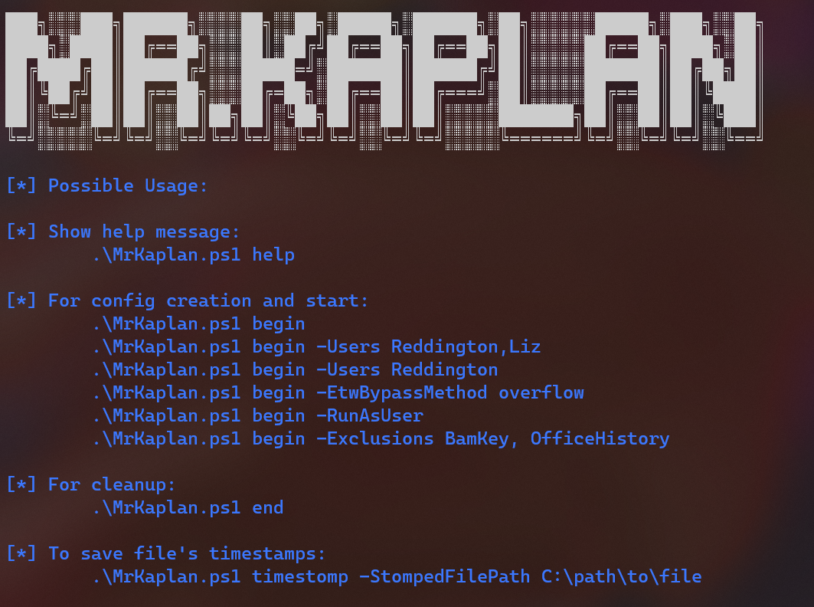

# Mr.Kaplan

 

## Description

MrKaplan is a tool aimed to help red teamers to stay hidden by clearing evidence of execution. It works by saving information such as the time it ran, snapshot of files and associate each evidence to the related user.

This tool is inspired by [MoonWalk](https://github.com/mufeedvh/moonwalk), a similar tool for Unix machines.

You can read more about it in the [wiki](https://github.com/idov31/MrKaplan/wiki) page.

## Features

- Stopping event logging.
- Clearing files artifacts.
- Clearing registry artifacts.
- Can run for multiple users.
- Can run as user and as admin (Highly recommended to run as admin).
- Can save timestamps of files.
- Can exclude certian operations and leave artifacts to blue teams.

## Usage

- Before you start your operations on the computer, run MrKaplan with begin flag and whenever your finish run it again with end flag.
- ***DO NOT REMOVE MrKaplan registry key until you rerun with the end flag***, otherwise MrKaplan will not be able to use the information.

## IOCs

- Powershell process that access to the artifacts mentioned in the wiki page.

- Powershell importing weird base64 blob.

- Powershell process that performs Token Manipulation.

- MrKaplan's registry key: HKCU:\Software\MrKaplan.

## Acknowledgements

- [PowerSploit](https://github.com/PowerShellMafia/PowerSploit)

- [Phant0m](https://github.com/hlldz/Phant0m)

- [ForensicArtifacts](https://github.com/ForensicArtifacts/artifacts/blob/main/data/windows.yaml)

## Disclaimer

I'm not responsible in any way for any kind of damage that is done to your computer / program as cause of this project. I'm happily accept contribution, make a pull request and I will review it!
